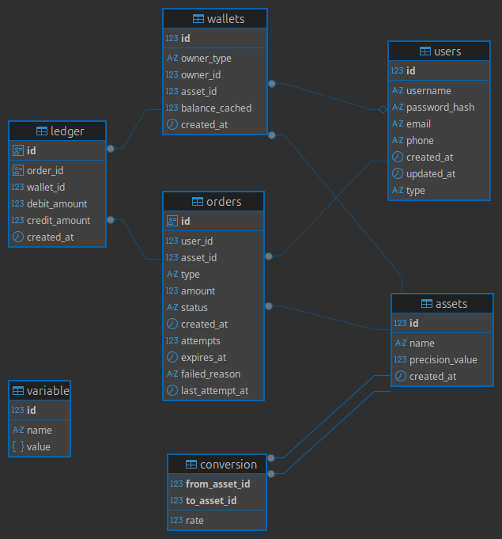

# **Dino Wallet Service**

A production-grade Internal Wallet Service built using Node.js, Express, TypeScript, TSOA, and PostgreSQL, designed to handle high-traffic virtual credit systems such as gaming platforms or loyalty applications.

    🔗 Live Swagger URL
    👉 https://dino-wallet-pqa5.onrender.com/api/docs/

    🔗 localhost Swagger URL
    👉 http://localhost/api/docs/

# **How To Run Locally**

    run in docker container: docker compose up --build 

    Swagger served at: http://localhost/api/docs

# Seed Data - execute seed.sql inside a postgres connection.

    Included in schema dinowallet - 
    Assets
        - Credits (base asset)
        - Rewards
        - Gems

    System Wallets 
        - Pre-created system wallets for each asset.

    User: 
        execute: http://localhost:8000/api/users/register to register a new user and authenticate with that user 
        request payload: {
                            "username": "abc",
                            "password": "123",
                            "email": "abc@gmail.com"
                        } 

# Database
    

# Architecture Overview Stack

    - Node.js + Express
    - TypeScript
    - TSOA (OpenAPI + Typed Controllers)    
    - PostgreSQL (ACID compliant)
    - JWT Authentication (HS256 / RS256 support)
    - Docker + Docker Compose
    - Nginx Reverse Proxy
    - Helmet Security Middleware
    - Rate Limiting
    - Deployed on Render

# Application Flow

    - User registers via POST /users/register
    - Base wallet (credits) is automatically created for the user
    - User authenticates via GET /users/authenticate using BasicAuth
    - Server validates credentials and issues a signed JWT
    - Client stores JWT and includes it in:
        Authorization: Bearer <JWT_TOKEN>

    - User can now access protected endpoints:
        1. Top-up credits
        2. Spend credits
        3. Convert assets
        4. View wallets
        5. View ledger
        6. Execute orders

    All financial operations are executed transactionally with row-level locking and ledger recording


# Ledger-Based Architecture -

    This system uses a double-entry ledger model instead of simply mutating balances.

    Every transaction creates:

        - 1 debit entry
        - 1 credit entry

    This ensures:

        - Full auditability
        - No silent corruption
        - Immutable financial history
        - Reconstructable balances

    Example - 
    | Wallet        | Debit | Credit |
    | ------------  | ----- | ------ |
    | User Credits  | 0     | 100    |
    | System Debits | 100   | 0      |


# Transaction Flows (All ACID Compliant)

    All financial flows are executed inside database transactions.

    Wallet Top-up 
        Order created (type = topup)
        System wallet debited
        User wallet credited
        Ledger entries recorded
        Order marked completed

    Bonus / Incentive
        Order created (type = bonus)
        System wallet debited
        User wallet credited
        Ledger entries recorded

    Spend
        User wallet locked (SELECT FOR UPDATE)
        Balance checked
        User debited
        System credited
        Ledger entries recorded

    Asset Conversion
        Conversion rate fetched
        User base wallet debited
        Target asset wallet credited
        Wallet auto-created if missing
        Ledger entries recorded

# Idempotency Strategy

    Orders include:
        - Status tracking (pending, processing, completed, failed)
        - Attempt count
        - Expiry timestamp
        - Failure reason

    Duplicate or concurrent executions are safely handled.

# Deadlock Avoidance (Brownie Point)

    Wallets are locked in sorted order before updates:
    
    ```const walletIds = [fromWalletId, toWalletId].sort()```

    Prevents circular locking and database deadlocks.

# API Endpoints
    Authentication

        - POST /users/register
        - GET /users/authenticate

    Wallet Operations

        - POST /users/topup
        - POST /users/order
        - GET /users/order/{orderId}
        - GET /users/order/{orderId}/execute
        - POST /users/wallet/purchase/asset

    Wallet & Ledger

        - GET /users/profile
        - GET /users/wallets/{assetId}
        - GET /users/wallets/{walletId}/ledger

    All endpoints documented in Swagger.
